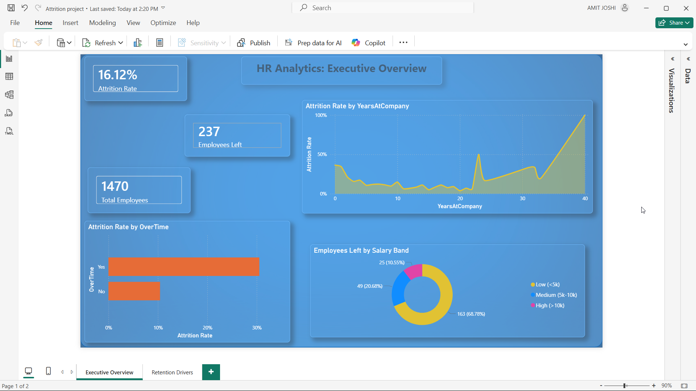
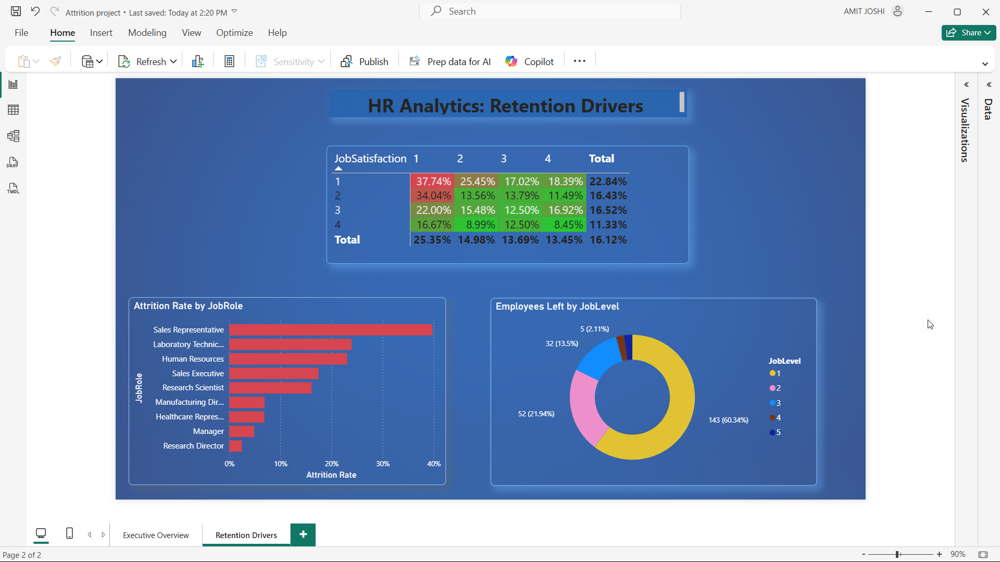

# 🏢 HR Employee Attrition Analysis — SQL + Power BI

## 📌 Project Overview

End-to-end HR attrition analysis on the IBM Watson HR dataset (1,470 employees, 35 variables).  
The goal was to identify **why employees leave** and provide actionable recommendations to HR leadership.

**Tools used:** MySQL · Power BI · DAX

---

## 📊 Dashboard Preview

### Executive Overview

### Retention Drivers

---

## 📂 Repository Structure
employee-attrition-sql/
├── Images/
│   ├── up1.png          # Executive Overview dashboard
│   └── up2.png          # Retention Drivers dashboard
├── Powerbi/
│   └── Attrition project.pbix
├── console.sql          # All SQL queries with comments
└── README.md

---

## 🔍 Key Findings

### Overall
- **237 out of 1,470 employees left — 16.1% attrition rate**

### 🏬 Department Analysis
| Department | Attrition Rate |
|------------|---------------|
| Sales | 20.6% 🚨 |
| Human Resources | 19.0% 🚨 |
| Research & Development | 13.8% ✅ |

> Sales and HR both exceed the company average of 16.1%

### ⏰ Overtime — The Strongest Driver
| Overtime | Attrition Rate |
|----------|---------------|
| Yes | **30.5%** 🚨 |
| No | 10.4% ✅ |

> Overtime employees are **3x more likely** to leave.  
> Critical insight: Overtime workers receive the **same salary hike** as non-overtime workers — effort goes unrecognized, fueling attrition.

### 💰 Salary & Compensation
| Salary Band | Attrition Rate |
|-------------|---------------|
| Low (< ₹3,000) | **28.6%** 🚨 |
| Mid (₹3,000–7,000) | 12.0% |
| High (> ₹7,000) | 10.8% ✅ |

- Employees who left earned avg **₹4,787/month**
- Employees who stayed earned avg **₹6,833/month**
- **Daily rate has no strong link to attrition** — surprising finding

### 👶 Age Group Analysis
| Age Group | Attrition Rate |
|-----------|---------------|
| 18–25 | **34.8%** 🚨 |
| 26–30 | 21.3% |
| 31–35 | 17.5% |
| 36–40 | 9.1% ✅ |
| 41–45 | 9.4% ✅ |
| 46+ | 12.5% |

> Young employees work overtime, receive no extra recognition, and see no career growth — leading to the highest attrition of any age group.

### ✈️ Business Travel
| Travel | Attrition Rate |
|--------|---------------|
| Non-Travel | 8% ✅ |
| Travel Rarely | 15% |
| Travel Frequently | **24.9%** 🚨 |

### 📅 Tenure — The Danger Zone
- **Year 0–1: 34–36% attrition** — most critical period
- Year 5+: drops below 10% — employees stabilize
- If an employee survives the first 2 years, they likely stay 5–7 years

### 🚨 High Risk Employee Profile
Employees with: Overtime = Yes + Job Satisfaction ≤ 2 + Monthly Income < ₹5,000

| Department | High Risk Count |
|------------|----------------|
| R&D | 60 |
| Sales | 14 |
| HR | 5 |

> R&D's low overall attrition (13.8%) hides a **large at-risk pool of 60 employees** — absolute numbers matter, not just percentages.

### 🎯 Job Role Analysis
- **Sales Representative: ~40% attrition** — highest of any role
- Laboratory Technician and Human Resources also high risk
- Job Level 1 employees account for **60.34% of all attrition**

### 😊 Satisfaction Analysis
| Environment Satisfaction | Attrition Rate |
|--------------------------|---------------|
| Low (1) | 25.4% 🚨 |
| High (4) | 13.5% ✅ |

Job Satisfaction Level 1 employees: **22.84% attrition** — nearly double Level 4

---

## 💡 Business Recommendations

1. **Revisit overtime policy** — strongest single attrition driver
2. **Recognize overtime employees** — same hike as non-OT workers causes silent frustration
3. **Revise compensation** for low salary band (< ₹3,000)
4. **Focus on Sales department** — highest attrition, urgent HR intervention needed
5. **Strengthen onboarding** — Year 0–2 is the danger zone
6. **Monitor R&D closely** — low overall attrition hides 60 high-risk employees
7. **Career growth for entry level** — Job Level 1 accounts for 60% of all attrition

---

## 🛠️ SQL Concepts Used
- `GROUP BY`, `ORDER BY`, `HAVING`
- `CASE WHEN` for salary banding and binary flags
- `ROUND`, `SUM`, `AVG`, `COUNT`
- `CAST` for data type conversion
- **CTE** (`WITH` clause) for high-risk employee profiling
- **Subquery** for departments above average attrition

---

## 🔗 Related Projects
- Python EDA version: [ibm-hr-attrition-eda-python](https://github.com/Amitj6124/ibm-hr-attrition-eda-python)

